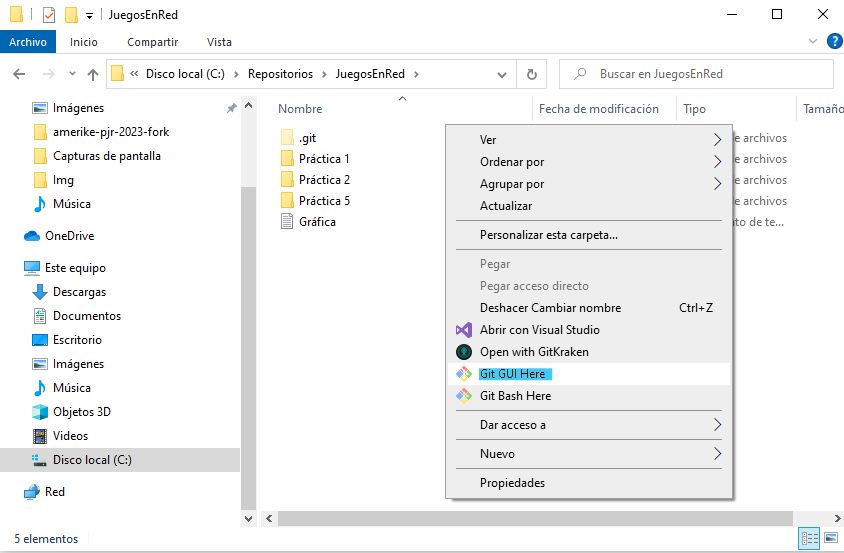
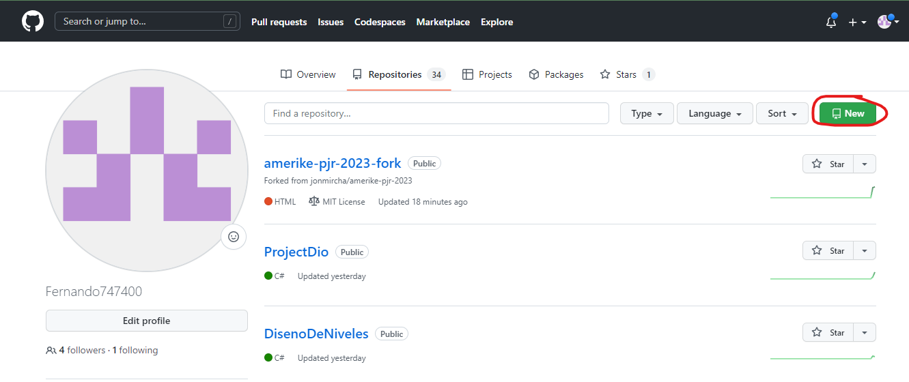
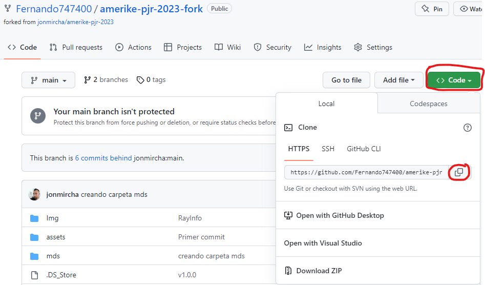

## ¿Cómo se inicializa un repositorio? ##
Para poder inicializar un reposiotorio se debe descargar *git* desde

 [Git Download](https://git-scm.com/) 

Una vez instalado, en la carpeta dónde se quiera iniciar, se corre un git bash. 



Se utiliza el comando:

``` bash
$git init
```

## ¿Cómo se crea un repositorio en GitHub? ##
Una vez creada una cuenta en [GitHub](https://github.com/) en tu perfil, en la pestaña de *Your Repositories* se le da click en *New*.



 Seleccionas el nombre y los settings que desees.

 

 ## ¿Cómo se vincula un repositorio? ##
 Una vez se inicializa el repo y se tiene un repo en GitHub, se tienen que vincular para poder subir los cambios al repositorio. 

 En la ventana de *git bash* que usamos para crear el repositorio de forma local se corre el comando:

 ``` bash
$git remote add origin https://github.com/username/new_repo
```
Remplazando el link del comando por el link de nuestro repositorio. 



## ¿Cómo hacer uso de los repositorios? ##
Una vez se tenga el repositorio vinculado, se puede empezar a trabajar en el. 

Realiza algunos cambios en la carpeta que tenga el repositorios. Sube una imagen, edita un documento, escribe código, etc.

Para agregar los cambios a tu repositorio en un *git bash* utiliza el comando: 

 ``` bash
$git add -A
```

Esto agregará todos tus cambios al *stash*

Ahora utiliza el comando:

 ``` bash
$git commit -m "Agregué x archivo"
```
Esto "empaquetará" tus cambios y los guardará en un *commit* junto con la descripción que pusiste. 

Fnalmente, para subir tus cambios a GitHub es necesario usar el comando: 

 ``` bash
$git push origin -u master
```
Esto subirá y publicará tu *commit* junto con tus cambios en GitHub a la *rama* "master". 

Para descargar los cambios que existan en GitHub a tu computadora, utiliza el comando:

 ``` bash
$git pull
```


