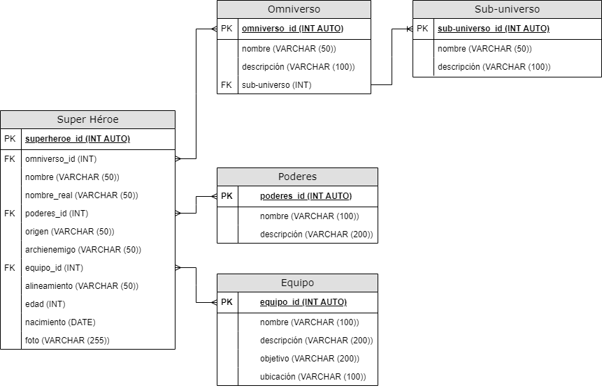

# Super Héroes # 

## Listado de Entidades

### Super Héroe **(ED)**

- superheroe_id **(PK)**
- omniverso_id **(FK)**
- nombre
- nombre_real 
- poderes_id **(FK)**
- origen 
- archienemigo
- equipo_id **(FK)**
- alineamiento
- edad
- nacimiento
- foto

### Omniverso **(EC)**

- omniverso_id **(PK)**
- nombre
- descripcion
- sub-universo **(FK)**

### Sub-Universo ###
- sub-universo **(PK)**
- nombre
- descripción

### Poderes **(EC)**

- poderes_id **(PK)**
- nombre
- descripción

### Equipo **(EC)**

- equipo_id **(PK)**
- nombre
- objetivo
- ubicación

## Relaciones

1. Muchos **Superhéroe** _pertenece_ a un **omniverso** (_M a 1_).
1. Muchos **Sub-universos** _pertenecen_ a un **omniverso** (_M a 1_).
1. Un **Superhéroe** _tiene_ uno o muchos **poderes** (_M a M_).
1. Un **Superhéroe** _pertenece_ a uno o muchos **equipos¨** (_M a M_).

## Diagrama ##

### Modelo Relacional de la BD ##

